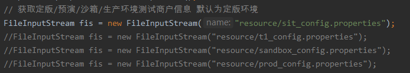
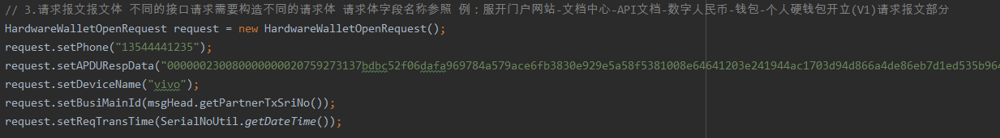
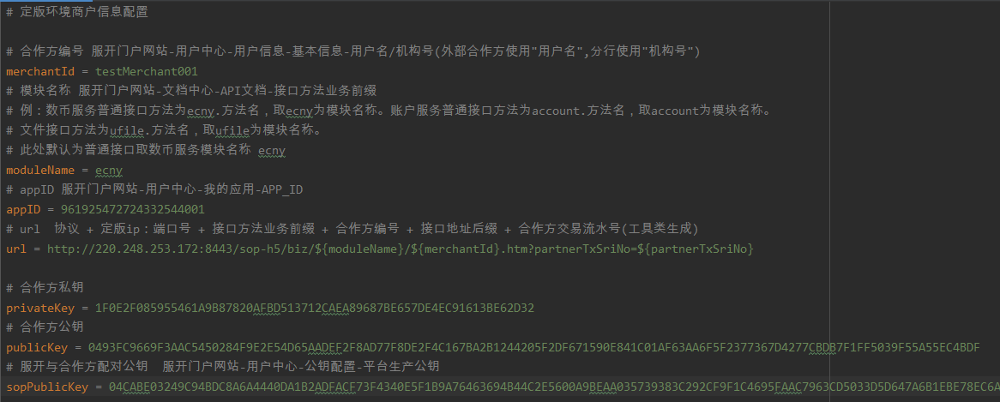

#### 简介
开放api部分包含普通接口及文件接口请求示例。提供定版，预演，沙箱，生产环境。定版环境为测试环境，预演环境为准生产环境，沙箱环境用来做上线前的环境验证。

src/demo/api下为普通接口请求demo，src/demo/file为文件接口请求demo。

测试demo时代码中可能需要改动的地方如下：

1.定版/预演/沙箱/生产环境配置

2.请求的接口方法

3.请求报文报文体



测试demo时配置文件中需要注意的地方如下：


1.moduleName需要根据普通接口/文件接口的请求变更

#### 详细结构
```
- img README.md文件图片
- lib library（库），demo使用的jar包
- resource 配置文件，用于配置demo使用的关键参数
- src
    -demo
        -api
            - 普通接口请求demo，合作方请求服开
        -common
            - error demo中的错误码
            - exceptions demo中统一异常的处理
            - pojo demo中使用的pojo类
            - util demo中通用工具类
        -file
            - 文件上传/下载接口请求demo
        -h5
            - H5 token 请求 demo
        -callback
            - 回调 demo，服开请求合作方        
```

